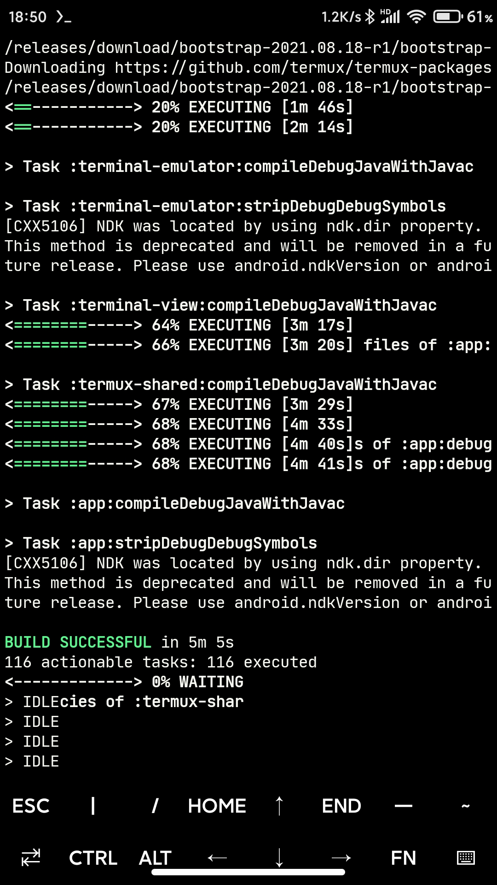
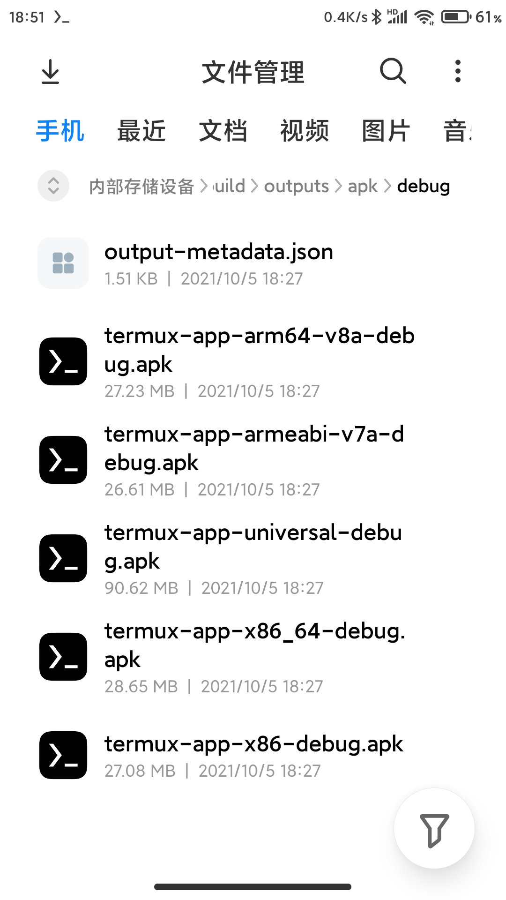

### How to use termux-ndk to build android app

Download the `android-ndk` and `android-sdk` from [release](https://github.com/Lzhiyong/termux-ndk/releases)
```bash
# install openjdk-17
pkg install openjdk-17

# install gradle
pkg install gradle

```

Add a `local.properties` file to the root of the project as below
```local.properties
# modify the local.properties file
# although ndk.dir has been deprecated, but it still works
sdk.dir=/path/to/android-sdk
ndk.dir=/path/to/android-ndk
cmake.dir=/path/to/cmake
# for example:
sdk.dir=/data/data/com.termux/files/home/opt/android-sdk
ndk.dir=/data/data/com.termux/files/home/opt/android-ndk-r26b
cmake.dir=/data/data/com.termux/files/home/opt/android-sdk/cmake
```
Modify the `project/build.gradle` file
```build.gradle
// set the Android gradle plugin version 
dependencies {
    classpath 'com.android.tools.build:gradle:8.1.0'
}
```
Modify the project `app/build.gradle` file
```build.gradle

android {
    // set the build tools version
    buildToolsVersion "34.0.0"
    
    externalNativeBuild {
        cmake {
            path "src/main/cpp/CMakeLists.txt"
            // If your cmake version >= 3.21, you must specify a version
            // 3.18.5+ or 3.25.1 and so on
            version "3.18.5+"
        }
    }
}
```

Execute the `gradle build` command to start building the android app, when building for the first time, 
the exec format error will occur, because the aapt2 is x86_64 architecture not aarch64, so we need to replace it

```bash
# replace the aapt2 with your own
# note: it's /path/to not /path/to/aapt2
find ~/.gradle -name 'aapt2-*-linux.jar' -type f | xargs -I{} jar -uvf {} -C /path/to aapt2
```
If an error occurs during the build app, this may be a network problem, please execute the `gradle build` again or execute the `gradle build --info` for more information.

**** 

### Building termux-app with termux
```gradle.properties
# clone the termux-app
git clone --depth=1 https://github.com/termux/termux-app

# add a local.properties file
sdk.dir=/path/to/android-sdk 
ndk.dir=/path/to/android-ndk 
cmake.dir=/path/to/cmake

# modify gradle.properties file 
minSdkVersion=24
targetSdkVersion=28
ndkVersion=26.1.10909125
compileSdkVersion=33
buildToolsVersion=34.0.0

# modify the build.gradle file
# termux-app/app/build.gradle 
# terminal-emulator/build.gradle 
# terminal-view/build.gradle 
# termux-shared/build.gradle
# set the buildToolsVersion
android {
    ...
    compileSdkVersion project.properties.compileSdkVersion.toInteger()
    // set the build tools version
    buildToolsVersion project.properties.buildToolsVersion.toString()
    ...
}

# start building
gradle assembleDebug

```
<div align="left">
    
</div>

**** 
### Building example
```bash
# GL2
cd GL2 && gradle installDebug

# GL3
cd GL3 && gradle installDebug

```
<div align="left">
    
</div>

**** 

### Known issues
Using proot or chroot linux is not recommended, this may have some problems, the building speed is much slower than the native Termux.
