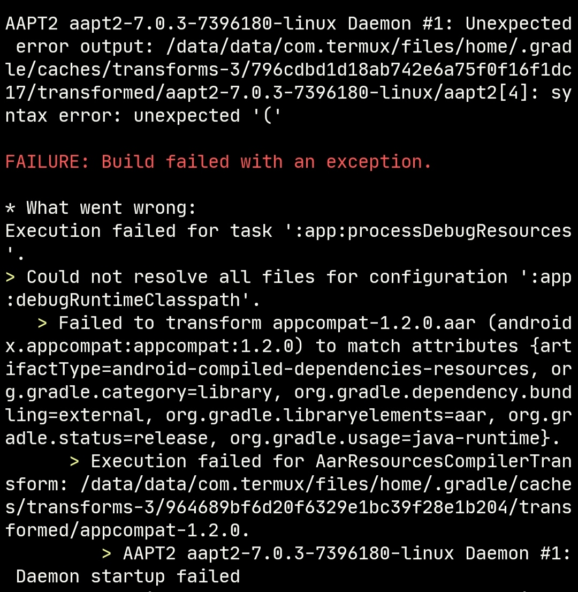
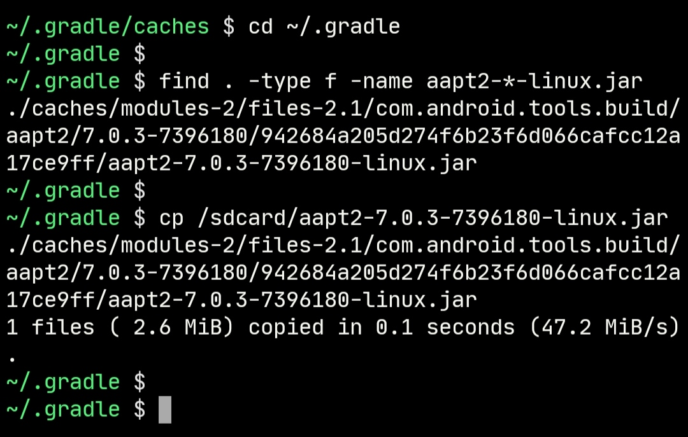
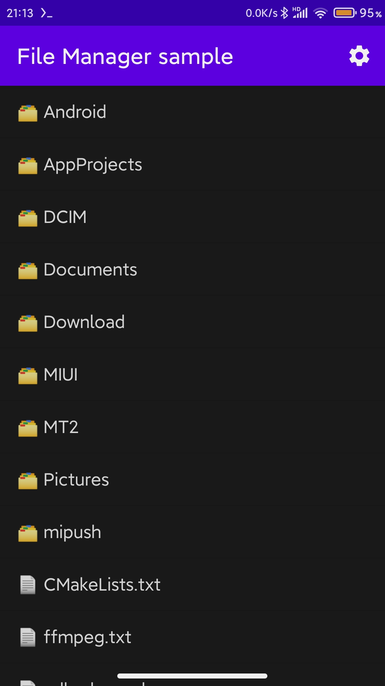
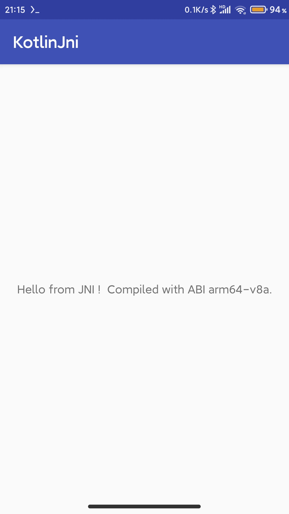

### How to use termux-ndk to build android app

Download the `android-ndk` and `android-sdk` from [release](https://github.com/Lzhiyong/termux-ndk/releases)
```bash
# install openjdk-17
pkg install openjdk-17

# install gradle
pkg install gradle

```

Add a `local.properties` file to the root of the project as below
```local.properties
# modify the local.properties file
# although ndk.dir has been deprecated, but it still works
sdk.dir=/path/to/android-sdk
ndk.dir=/path/to/android-ndk
cmake.dir=/path/to/cmake
# for example:
sdk.dir=/data/data/com.termux/files/home/opt/android-sdk
ndk.dir=/data/data/com.termux/files/home/opt/android-ndk-r23b
cmake.dir=/data/data/com.termux/files/home/opt/android-sdk/cmake
```
Modify the `project/build.gradle` file
```build.gradle
// set the Android gradle plugin version 
dependencies {
    classpath 'com.android.tools.build:gradle:7.0.3'
}
```
Modify the project `app/build.gradle` file
```build.gradle

android {
    ...
    // set the build tools version
    buildToolsVersion "31.0.0"
       
    defaultConfig {
        externalNativeBuild {
            cmake {
                arguments "-DANDROID_APP_PLATFORM=android-30", "-DANDROID_STL=c++_static"
                abiFilters 'armeabi-v7a', 'arm64-v8a', 'x86', 'x86_64'
            }
        }
    }
    
    externalNativeBuild {
        cmake {
            path "src/main/cpp/CMakeLists.txt"
            // If your cmake version >= 3.21, you must specify a version
            // 3.18.5+ or 3.22.0 and so on
            version "3.18.5+"
        }
    }
   ...
}
```

Execute the `gradle build` command to start building the android app, when building for the first time, the below error will occur.</br> 
this is because the gradle plugin will download a corresponding version of aapt2-7.0.3-7396180-linux.jar, we need to replace it.
<a href="./screenshot/build_aapt2_error1.jpg"></a>

Replace the aapt2 in aapt2-7.0.3-7396180-linux.jar inside with [sdk-tools/build-tools/aapt2](https://github.com/Lzhiyong/sdk-tools/releases)
```bash
# aapt2 is inside the jar file(aapt2-7.0.3-7396180-linux.jar)
# because the aapt2 is x86_64 architecture not aarch64, so we need to replace it
# execute the find command to search aapt2-xxx-linux.jar, then replace it
cd ~/.gradle
find . -type f -name aapt2-*-linux.jar
cp /path/to/aapt2-7.0.3-7396180-linux.jar ./caches/modules-2/files-2.1/com.android.tools.build/aapt2/7.0.3-7396180/942684a205d274f6b23f6d066cafcc12a17ce9ff/aapt2-7.0.3-7396180-linux.jar
```
<a href="./screenshot/build_aapt2_error2.jpg"></a>
   
If an error occurs during the build app, this may be a network problem, please execute the `gradle build` again or execute the `gradle build --info` for more information.

**** 

### Making AGP jar file
```bash
# your directory
cd /path/to/your_dir

# copy the aapt2-xxx-linux.jar to your directory
# aapt2-xxx-linux.jar from ~/.gradle/caches
# use find command to serach the jar file
cp /path/to/aapt2-xxx-linux.jar your_dir

# copy the aapt2 to your directory
# aapt2 from sdk-tools release
cp /path/to/aapt2 your_dir

# update the aapt2-xxx-linux.jar
jar -uvf aapt2-xxx-linux.jar aapt2

```

**** 

### Building termux-app with termux
```gradle.properties
# clone the termux-app
git clone --depth=1 https://github.com/termux/termux-app

# add a local.properties file
sdk.dir=/path/to/android-sdk 
ndk.dir=/path/to/android-ndk 
cmake.dir=/path/to/cmake

# modify gradle.properties file 
minSdkVersion=24
targetSdkVersion=28
ndkVersion=23.1.7779620
compileSdkVersion=30
buildToolsVersion=31.0.0

# modify the build.gradle file
# termux-app/app/build.gradle 
# terminal-emulator/build.gradle 
# terminal-view/build.gradle 
# termux-shared/build.gradle
# set the buildToolsVersion
android {
    ...
    compileSdkVersion project.properties.compileSdkVersion.toInteger()
    // set the build tools version
    buildToolsVersion project.properties.buildToolsVersion.toString()
    ...
}

# start building
gradle assembleDebug

```
<div align="left">
    
</div>

**** 
### Building example
```bash
# File Manager
cd example/FileManager

# cmake-example
cd example/cmake-example

# hello-jni-kotlinApp
cd example/hello-jni-kotlinApp

gradle assembleDebug
```
<div align="left">
    
</div>

**** 

### Known issues
Using proot or chroot linux is not recommended, this may have some problems, the building speed is much slower than the native Termux.
