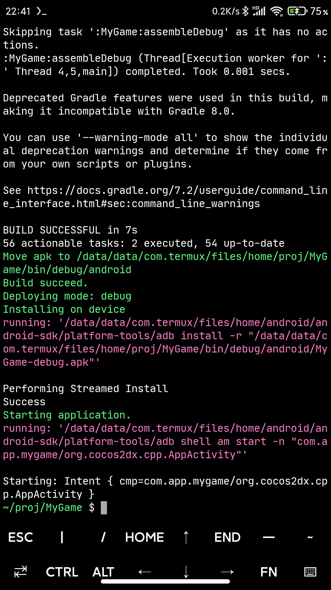
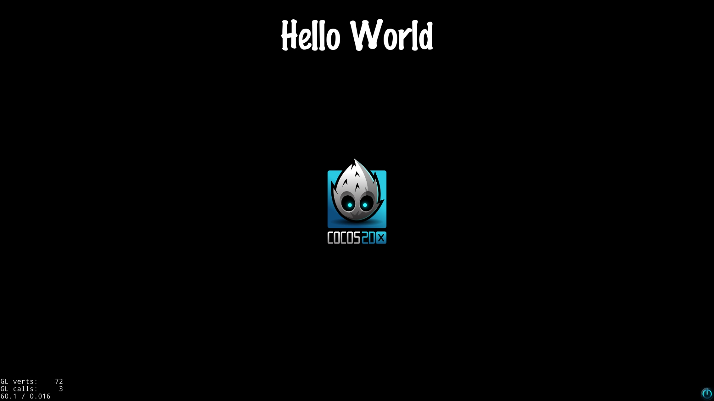

Building cocos2d-x game for android with termux-ndk</br>

For more details information, please refer to [cocos2d-x](https://github.com/cocos2d/cocos2d-x)

#### Install python2
```bash
pkg install python2
```

#### Clone the repository
```bash
# clone the repo to termux from github
git clone --depth=1 https://github.com/cocos2d/cocos2d-x.git

# after cloning the repo, please execute download-deps.py to download and install dependencies
cd cocos2d-x
python2 download-deps.py

# after running download-deps.py
git submodule update --init

```

#### Setup the environment
```bash
# the ANDROID_SDK_ROOT will fail
# Error: /path/to/android-sdk is not a valid path of ANDROID_SDK_ROOT Ignoring it.
# modify the setup.py, please see the setup.py.patch
# then execute setup.py again
python2 setup.py
source ~/.bashrc
```

#### Modify the templates projects

* set the gradle plugin version, see [cpp-template-default/proj.android/build.gradle](https://github.com/Lzhiyong/termux-ndk/blob/902f483485b42c73ffe354b725a4676f8b0c468a/cocos2d-game/templates/cpp-template-default/proj.android/build.gradle#L10)

* add Android SDK build-tools version, see [cpp-template-default/proj.android/gradle.properties](https://github.com/Lzhiyong/termux-ndk/blob/902f483485b42c73ffe354b725a4676f8b0c468a/cocos2d-game/templates/cpp-template-default/proj.android/gradle.properties#L30)

* set buildToolsVersion, see [cpp-template-default/proj.android/app/build.gradle](https://github.com/Lzhiyong/termux-ndk/blob/902f483485b42c73ffe354b725a4676f8b0c468a/cocos2d-game/templates/cpp-template-default/proj.android/app/build.gradle#L8)

* set buildToolsVersion for libcocos2dx, see [libcocos2dx/build.gradle](https://github.com/Lzhiyong/termux-ndk/blob/902f483485b42c73ffe354b725a4676f8b0c468a/cocos2d-game/templates/libcocos2dx/build.gradle#L6)

* lua-template-default is the same


#### Start new game project
```bash
# your project
cd /path/to/your_project

# you can also create a Lua project with -l lua
cocos new MyGame -p com.xxx.xxx -l cpp

# your game
cd MyGame

# No need to use --proj-dir, this will cause an error, gradle.properties cannot be found
# if you want to use --proj-dir, need to use absolute path, for example --proj-dir /path/to/MyGame/proj.android
cocos run -p android

```

#### Building test
```bash
# you need to manually modify the build.gradle and gradle.properties files
# please refer to the template project above
cd cocos2d-x/tests/cpp-test
cocos run -p android

```

### Issues
* ANDROID_SDK_ROOT</br>
modify `coco2d-x/setup.py`</br>
see [setup.py.patch](https://github.com/Lzhiyong/termux-ndk/blob/master/cocos2d-game/patches/setup.py.patch)

* cmake cannot found</br>
modify `cocos2d-x/tools/cocos2d-console/plugins/plugin_compile/build_android.py`</br>
see [build_android.py.patch](https://github.com/Lzhiyong/termux-ndk/blob/master/cocos2d-game/patches/build_android.py.patch)

* unable to find library from dependent library specifier lua51.lib</br>
modify `cocos2d-x/cocos/scripting/lua-bindings/manual/CCLuaEngine.cpp`</br>
see [CCLuaEngine.cpp.patch](https://github.com/Lzhiyong/termux-ndk/blob/master/cocos2d-game/patches/CCLuaEngine.cpp.patch)

**** 
**Screenshot**
<div align="left">
    
</div>

**Hello World**
<div align="left">
    
</div>

 **** 
